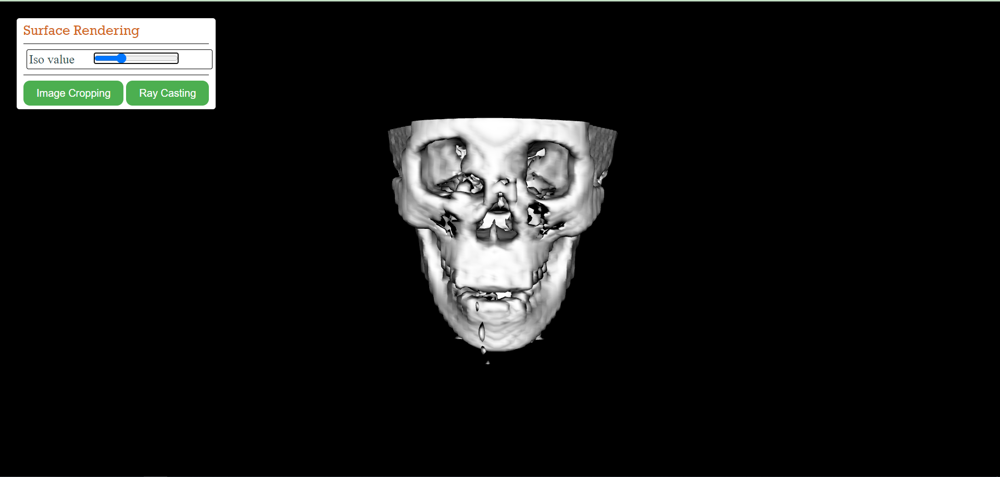
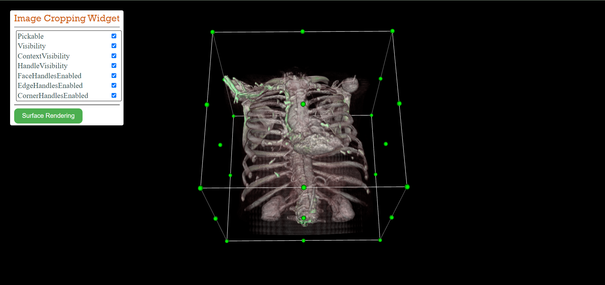
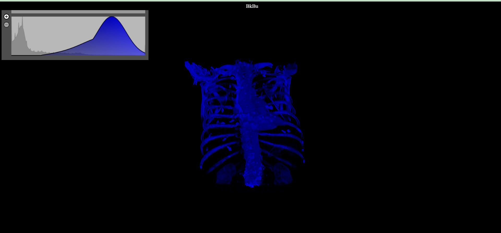

# Computer Graphics VTK.js Project

## About Our Project

### First, we disscused some examples supported by VTK.js website to understand the mechanism of it.
 Then we build our project by rendering three differnet widgets:
 1. Surface Rendering using volume contour widget.
 2. Image Cropping Widget.
 3. Ray Casting using PeiceWise Guassian Widget.
 

 > First we ran volume contour widget.
 Here was some errors found in the url of data that our server couldn't fetch the data source, and could overcome this problem by specifying the url on github with raw json file as follows. <br>

 ```
reader
    .setUrl(`https://kitware.github.io/vtk-js/data/volume/headsq.vti/`, { loadData: true })
    .then(() => {
        .
        .
        .
 ```



> Second we ran image croppping widget as follows.
<br>



> And the last widget for Ray Casting.
<br>



Then we applied some styles to our control panel to appear as shown above; like font-size, font-family, color,....<br>
After that we wanted to merge all files to work together so we used buttons to connect the files.<br>
This was done in Javascript using `addEventListener` method.<br>

In Surface REndering file --> index.js

* In HTML:

```
<button class="btnWidget" id="chestbtn">Image Cropping</button>

<button class="btnWidget" id="piecebtn">Ray Casting</button>
```

* In Javascript:

```
const chestbtn = document.querySelector('#chestbtn');
chestbtn.addEventListener("click", imageCropping);

const piecebtn = document.querySelector('#piecebtn');
piecebtn.addEventListener("click", piecewise);
```

There was a problem here in applying the addEventListener as it wasn't connect to the button and the solution was that to place these functions below the `addController` method in Javascript file. <br>

```
fullScreenRenderWindow.addController(controlPanel);
// Write Every addListener Function below this line.

const chestbtn = document.querySelector('#chestbtn');
.
.

```

> After applying all these features together this was the final output.<br>


> Finially Applying Some animations.<br>


